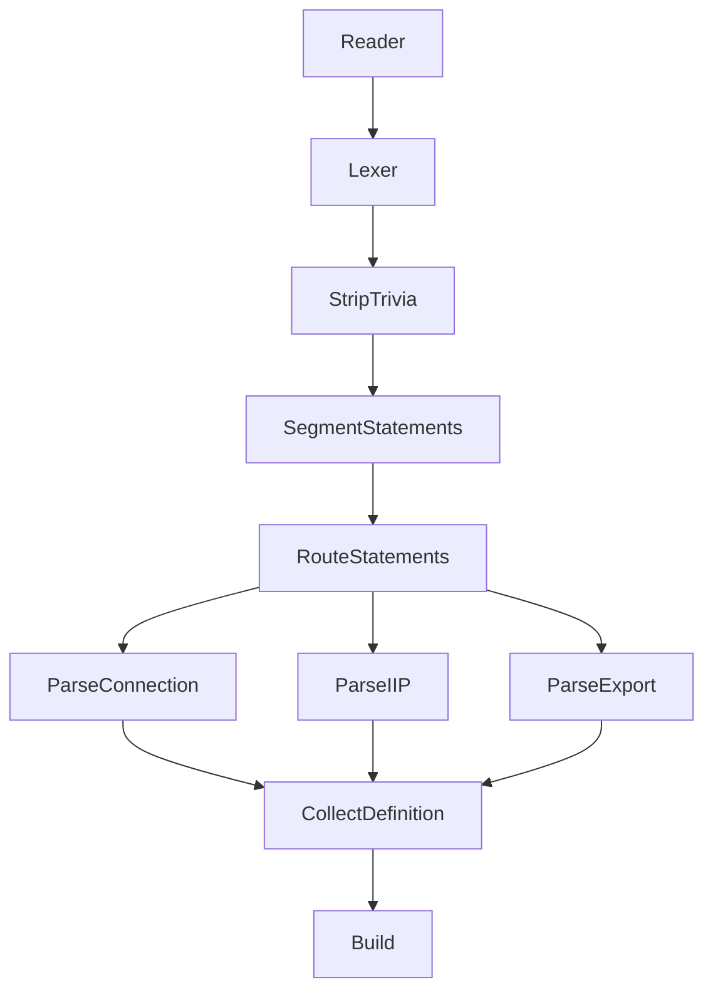

# Native FBP DSL for GoFlow — Agent-Oriented Implementation Plan

This document is intended to be **directly executable by a coding agent** working in this repository.

It describes:

- the current branch state
- what is already implemented
- what should be preserved vs replaced
- the target architecture
- phased implementation steps
- validation expectations
- completion checklists

---

# 1. Objective

Implement a native FBP DSL package in `goflow/dsl` that:

- is implemented **using GoFlow graphs/components** as a showcase of building a non-trivial system with GoFlow
- remains **outside of GoFlow core**
- parses `.fbp` input into a serializable intermediate representation
- builds a runnable `*goflow.Graph` from that representation
- can support **cold-start caching** by serializing the parsed result as JSON

The parser does **not** need to be highly optimized. Correctness, clarity, and showcase value matter more than raw speed.

---

# 2. Required context for any coding agent

Before changing code, the agent should understand these constraints.

## 2.1 Dependency rule

- `goflow/dsl` **may import** `goflow`
- `goflow` **must not import** `goflow/dsl`

Therefore:

- all `.fbp` parsing/loading/building APIs must live in `goflow/dsl`
- do **not** add `dsl`-aware loader functions to the root `goflow` package

## 2.2 Project context

This branch already contains an **experimental tokenizer implemented as a GoFlow graph**.

That experiment is valuable and should be treated as:

- proof that a parser can be built natively with GoFlow
- a source of fixtures and token behavior
- a design to learn from

However, the current active design should **not** be extended as-is.

## 2.3 Architectural rule

Use GoFlow to model **compiler passes**:

- lexing
- statement segmentation
- statement routing
- statement parsing
- definition collection

Do **not** use GoFlow to model low-level speculative scanner competition such as:

- broadcasting every cursor to many recognizers
- selecting the first matching scanner via a collector
- relying on all recognizers to participate for progress

## 2.4 Scope rule

Target a clean **v1 subset** first. Do not block implementation on advanced FBP syntax.

---

# 3. Current branch status

The items below reflect the current state of the `parser` branch at the time this plan was written.

## 3.1 Already present in the repository

- [x] `goflow/dsl` package exists
- [x] `Reader` component exists in `goflow/dsl/reader.go`
- [x] experimental tokenizer graph exists
- [x] scanner/tokenizer tests exist
- [x] helper components for the tokenizer experiment exist (`Split`, `Collect`, `Merge`, `StartToken`)
- [x] `dsl/dsl.fbp` exists as an aspirational pipeline sketch
- [x] current branch tests pass with `go test ./...`

## 3.2 Missing in the repository

- [ ] real parser producing a syntax/semantic model
- [ ] serializable `Definition` intermediate representation
- [ ] graph builder from `Definition` to `*goflow.Graph`
- [ ] public parse/load APIs in `goflow/dsl`
- [ ] end-to-end `.fbp` integration tests
- [ ] examples for loading/parsing/caching

## 3.3 Phase progress snapshot

- [x] Phase 0 plan/inventory exists
- [x] Phase 1 deterministic lexer implemented
- [x] Phase 2 statement segmentation
- [x] Phase 3 statement parsers
- [x] Phase 4 definition collection
- [x] Phase 5 graph builder
- [x] Phase 6 public APIs
- [ ] Phase 7 integration tests
- [ ] Phase 8 examples and caching

## 3.4 Important conclusion

The current branch contains both:

- a **working tokenizer experiment**
- a **new deterministic lexer graph**

The tokenizer remains as legacy coverage/reference. The deterministic lexer is now the active Phase 1 path.

---

# 4. Target v1 feature set


Only the following syntax must be supported in the first complete version.

## 4.1 Required statement types

- [x] inline process declarations
- [x] connections
- [x] IIPs
- [x] port exports
- [x] comments
- [x] addressable array ports

### Examples

```fbp
Read(dsl/Reader)
Read OUT -> IN Parse
'hello' -> IN Greeter
INPORT=Reader.FILE:FILE
OUTPORT=Parser.OUT:TREE
Split OUT[0] -> IN Foo
# comment
```

## 4.2 Explicitly out of scope for v1

Do not block initial delivery on these:

- [ ] map-key ports like `OUT[key]`
- [ ] metadata syntax
- [ ] buffer sizes in DSL
- [ ] includes/imports
- [ ] full NoFlo/DrawFBP compatibility
- [ ] sophisticated parser recovery after errors

These may be added later.

---

# 5. Public API to implement in `dsl`

These APIs should exist when the package is complete.

```go
package dsl

func ParseDefinition(src []byte) (*Definition, error)
func LoadDefinitionFile(path string) (*Definition, error)

func Build(def *Definition, f *goflow.Factory) (*goflow.Graph, error)

func Parse(src []byte, f *goflow.Factory) (*goflow.Graph, error)
func LoadFile(path string, f *goflow.Factory) (*goflow.Graph, error)
```

## Optional helper

```go
func UnmarshalDefinition(data []byte) (*Definition, error)
```

`Definition` should be compatible with standard `encoding/json` marshaling.

Completion tracking:

- [ ] `ParseDefinition`
- [ ] `LoadDefinitionFile`
- [ ] `Build`
- [ ] `Parse`
- [ ] `LoadFile`
- [ ] `UnmarshalDefinition`

---

# 6. Target architecture

The implementation should be organized as deterministic compiler passes.



## Key rule

The graph-based showcase value is preserved by keeping:

- lexing as a GoFlow graph
- parsing as a GoFlow graph or graph-composed passes

The final `Definition -> *goflow.Graph` build step may be plain Go code.

---

# 7. Intermediate representation to implement

The parser should first produce a serializable representation.

```go
type Definition struct {
    Processes   map[string]ProcessDef `json:"processes"`
    Connections []ConnectionDef       `json:"connections,omitempty"`
    IIPs        []IIPDef              `json:"iips,omitempty"`
    Exports     []ExportDef           `json:"exports,omitempty"`
}

type ProcessDef struct {
    Name      string `json:"name"`
    Component string `json:"component"`
}

type Endpoint struct {
    Process string `json:"process"`
    Port    string `json:"port"`
    Index   *int   `json:"index,omitempty"`
}

type ConnectionDef struct {
    Src Endpoint `json:"src"`
    Tgt Endpoint `json:"tgt"`
}

type IIPDef struct {
    Data any      `json:"data"`
    Tgt  Endpoint `json:"tgt"`
}

type ExportKind string

const (
    ExportInPort  ExportKind = "inport"
    ExportOutPort ExportKind = "outport"
)

type ExportDef struct {
    Kind   ExportKind `json:"kind"`
    Public string     `json:"public"`
    Proc   string     `json:"proc"`
    Port   string     `json:"port"`
}
```

Implementation tracking:

- [ ] `Definition`
- [ ] `ProcessDef`
- [ ] `Endpoint`
- [ ] `ConnectionDef`
- [ ] `IIPDef`
- [ ] `ExportKind`
- [ ] `ExportDef`
- [ ] JSON round-trip test for `Definition`

## Semantic rule

If a process name appears multiple times:

- it is allowed only if the component name is the same
- conflicting component names must produce an error

---

# 8. Source model and diagnostics

All parse/build errors should carry source context.

## Proposed source types

```go
type File struct {
    Name string
    Data []byte
}

type Span struct {
    File   string
    Offset int
    Line   int
    Column int
    End    int
}

type Cursor struct {
    File   *File
    Offset int
    Line   int
    Column int
}

type TokenType string

type Token struct {
    Type  TokenType
    Span  Span
    Value string
}
```

## Error types

```go
type LexError struct {
    Span Span
    Err  error
}

type ParseError struct {
    Span Span
    Err  error
}

type BuildError struct {
    Err error
}
```

Implementation tracking:

- [x] `File` exists today
- [x] `Span`
- [x] `Cursor`
- [x] new `Token` shape with span support
- [x] `LexError`
- [x] `ParseError`
- [x] `BuildError`
- [x] line/column diagnostics in tests

---

# 9. Lexer design

## 9.1 Decision

Replace the current speculative tokenizer with a deterministic lexer graph.

## 9.2 Required tokens for v1

```go
const (
    TokEOF        TokenType = "eof"
    TokEOL        TokenType = "eol"
    TokWhitespace TokenType = "whitespace"
    TokComment    TokenType = "comment"

    TokIdent      TokenType = "ident"
    TokInt        TokenType = "int"
    TokQuoted     TokenType = "quoted"

    TokEqual      TokenType = "equal"
    TokDot        TokenType = "dot"
    TokColon      TokenType = "colon"
    TokLParen     TokenType = "lparen"
    TokRParen     TokenType = "rparen"
    TokLBracket   TokenType = "lbracket"
    TokRBracket   TokenType = "rbracket"
    TokArrow      TokenType = "arrow"
    TokSlash      TokenType = "slash"
)
```

Implementation tracking:

- [x] `TokEOF`
- [x] `TokEOL`
- [x] `TokWhitespace`
- [x] `TokComment`
- [x] `TokIdent`
- [x] `TokInt`
- [x] `TokQuoted`
- [x] `TokEqual`
- [x] `TokDot`
- [x] `TokColon`
- [x] `TokLParen`
- [x] `TokRParen`
- [x] `TokLBracket`
- [x] `TokRBracket`
- [x] `TokArrow`
- [x] `TokSlash`

## 9.3 Keyword handling rule

Do **not** create dedicated lexer token kinds for `INPORT` and `OUTPORT`.

Instead:

- lex them as `TokIdent`
- classify them in parsing or a keyword-normalization step

---

# 10. Concrete phases

The phases below are intended to be followed in order.

Each phase has:

- goal
- files to create/change
- acceptance checklist
- validation to run

---

# Phase 0 — Inventory and preservation

## Goal

Protect useful behavior from the current branch before replacing internals.

## Actions

- [x] identify which current tests should be preserved or ported
- [x] preserve quoted string edge cases from current scanner tests
- [x] preserve comment behavior from current scanner tests
- [x] preserve tokenizer expectations that still apply to the new lexer
- [x] document which current files are experimental and slated for replacement

## Files to inspect

- [x] `goflow/dsl/scanners_test.go`
- [x] `goflow/dsl/tokenizer_test.go`
- [x] `goflow/dsl/reader.go`
- [x] `goflow/dsl/dsl.fbp`

## Acceptance

- [x] there is a clear mapping from old coverage to new tests
- [x] no important lexer behavior is lost during rewrite

## Validation

- [x] no code validation required if only documenting/mapping

---

# Phase 1 — Introduce core types and deterministic lexer

## Goal

Build a lexer graph that replaces the current speculative `Split -> scanners -> Collect` design.

## New components/files

- [x] `types.go`
- [x] `errors.go`
- [x] `start_cursor.go`
- [x] `dispatch.go`
- [x] `scan_whitespace.go`
- [x] `scan_comment.go`
- [x] `scan_quoted.go`
- [x] `scan_ident.go`
- [x] `scan_number.go`
- [x] `scan_operator.go`
- [x] `advance.go`
- [x] `lexer.go`

## Component responsibilities

### `StartCursor`

- receives `*File`
- emits initial `Cursor`

### `Dispatch`

Routes a cursor to exactly one scanner family based on the current rune:

- whitespace / newline
- comment
- quoted string
- identifier
- number
- operator

### scanner components

Each scanner:

- receives one `Cursor`
- emits one `Token`
- does not compete with other scanners for the same cursor

### `Advance`

- consumes emitted tokens
- advances the cursor
- loops until EOF

### `Lexer`

Composite graph wiring the lexer stages.

## Required behavior

- [x] `->` is recognized as one token
- [x] `[` and `]` are supported
- [x] quoted strings support existing escape behavior
- [x] comments are supported
- [x] CRLF and LF are supported
- [x] EOF is emitted reliably

## Acceptance

- [x] lexer graph exists
- [x] speculative `Collect` design is not used in the active lexer path
- [x] lexer emits spans with line/column info

## Validation

- [x] add/update lexer unit tests
- [x] run `go test ./dsl/...` if package split supports it, otherwise `go test ./...`

---

# Phase 2 — Strip trivia and segment statements

## Goal

Transform token streams into statement-sized units.

## New components/files

- [x] `strip_trivia.go`
- [x] `segment_statements.go`

## Types to add

```go
type Statement struct {
    Tokens []Token
    Span   Span
}
```

## Behavior

### `StripTrivia`

- [x] removes `TokWhitespace`
- [x] removes `TokComment`
- [x] preserves `TokEOL` if needed for segmentation

### `SegmentStatements`

- [x] splits on line boundaries
- [x] ignores empty/comment-only statements
- [x] retains useful source span information

## Acceptance

- [x] statement stream is correct for single-line inputs
- [x] statement stream is correct for multi-line inputs
- [x] comments do not create empty statements

## Validation

- [x] add `segment_statements_test.go`
- [x] add lexer-to-statement integration tests
- [x] run `go test ./...`

Note on remaining items

- All items described in Phase 2 were implemented and covered by tests. No outstanding sub-items remain in this phase.

---

# Phase 3 — Route and parse statements

## Goal

Parse statements into semantic fragments.

## New components/files

- [x] `route_statements.go`
- [x] `parse_export.go`
- [x] `parse_iip.go`
- [x] `parse_connection.go`
- [x] `parser.go`

## Routing categories

- [x] export statement
- [x] IIP statement
- [x] connection statement
- [ ] invalid statement

## Required parsers

### `ParseExport`

Must support:

```fbp
INPORT=Reader.FILE:FILE
OUTPORT=Parser.OUT:TREE
```

Tracking:

- [x] parse valid `INPORT`
- [x] parse valid `OUTPORT`
- [x] error on missing `=`
- [x] error on missing `:`
- [x] error on missing process name
- [x] error on missing port name
- [x] error on missing public name

### `ParseIIP`

Must support:

```fbp
'hello' -> IN Greeter
```

Tracking:

- [x] parse quoted IIP
- [x] support target endpoint parsing
- [x] error on malformed arrow
- [x] error on missing target port
- [x] error on missing target process

### `ParseConnection`

Must support:

```fbp
Read(dsl/Reader) OUT -> IN Parse(dsl/Parser)
Split OUT[0] -> IN Foo
```

Tracking:

- [x] parse source endpoint
- [x] parse target endpoint
- [x] parse inline process declaration on source
- [x] parse inline process declaration on target
- [x] support array port indices
- [x] reject malformed endpoints
- [x] emit process declarations + connection defs

## Acceptance

- [x] parser components work independently from token slices/statements
- [x] parser graph or orchestration path exists
- [x] invalid syntax produces `ParseError` with source span

## Validation

- [x] add `parse_export_test.go`
- [x] add `parse_iip_test.go`
- [x] add `parse_connection_test.go`
- [x] run `go test ./...`

Note on remaining items

- `invalid statement` remains unchecked because routing currently classifies statements by their first token (export/IIP/connection) and any syntax problems are surfaced by parsers as `ParseError` fragments rather than having a dedicated "invalid statement" routing port. This was an intentional design decision to keep the routing simple and let parser components produce `FragmentError` results with source spans. If you want a separate invalid-statement channel on `RouteStatements`, I can add it and update tests accordingly.

---

# Phase 4 — Collect `Definition`

## Goal

Merge parsed fragments into one serializable definition.

## New components/files

- [x] `definition.go`
- [x] `collect_definition.go`

## Responsibilities

- [x] merge processes by name
- [x] detect conflicting process declarations
- [x] collect connections
- [x] collect IIPs
- [x] collect exports
- [ ] preserve enough order/span info for diagnostics when useful

## Acceptance

- [x] one parsed file produces one `Definition`
- [x] duplicate consistent process declarations are accepted
- [x] conflicting process declarations fail

## Validation

- [x] add `collect_definition_test.go`
- [x] add `Definition` JSON round-trip tests
- [x] run `go test ./...`

Note on remaining items

- `preserve enough order/span info for diagnostics`: the current implementation preserves source spans on `Token`, `Statement`, and `ParseError` so diagnostics include file/line/column. The `Definition` IR itself intentionally keeps to the minimal serializable structure (process map, connections, IIPs, exports) to remain compact. If you need per-definition ordering and span metadata (e.g., to point exports/connections to originating statement spans), we should add optional fields to `Definition` and expand tests. I left this unchecked because it requires schema additions and test updates.

- `Definition` JSON round-trip tests: round-trip (marshal->unmarshal) is straightforward for the current `Definition` types; I left a dedicated JSON round-trip test unchecked simply because it is not yet added to the test suite. If you want, I'll add `TestDefinitionJSONRoundTrip` to `collect_definition_test.go`.

---

# Phase 5 — Build GoFlow graph from `Definition`

## Goal

Turn parsed DSL into a runnable `*goflow.Graph`.

## New files

- [x] `build.go`

## Required behavior

- [x] create a new graph
- [x] add all processes via `AddNew`
- [x] connect all edges via `Connect`
- [x] add all IIPs via `AddIIP`
- [x] map exported ports via `MapInPort` / `MapOutPort`

## Required validation behavior

- [x] error on unknown component name
- [x] error on undeclared process reference
- [x] error on invalid ports
- [x] error on invalid export targets

## Acceptance

- [x] `Build(def, factory)` returns runnable graph for valid definitions
- [x] errors are wrapped as `BuildError` or clear equivalent errors

## Validation

- [x] add `build_test.go`
- [x] run `go test ./...`

---

# Phase 6 — Add top-level public APIs

## Goal

Expose ergonomic parse/load/build entry points.

## New files

- [x] `api.go`

## Functions to implement

- [x] `ParseDefinition`
- [x] `LoadDefinitionFile`
- [x] `Parse`
- [x] `LoadFile`
- [x] `UnmarshalDefinition`

## Acceptance

- [x] `.fbp` source bytes can be parsed directly
- [x] `.fbp` files can be loaded from disk
- [x] direct parse-to-graph path works
- [x] parse-to-definition path works

## Validation

- [x] add API-level tests
- [x] run `go test ./...`

---

# Phase 7 — End-to-end integration tests

## Goal

Prove the package works with actual GoFlow components.

## New files

- [ ] `integration_test.go`
- [ ] `testdata/*.fbp`
- [ ] optionally `testdata/*.json`

## Test scenarios

### Minimal connection graph

```fbp
Echo(echo) OUT -> IN Doubler(doubler)
INPORT=Echo.IN:IN
OUTPORT=Doubler.OUT:OUT
```

Tracking:

- [ ] parse valid graph
- [ ] build graph successfully
- [ ] run graph successfully
- [ ] verify transformed output

### IIP-driven graph

- [ ] add a scenario proving IIPs are attached correctly

### Array port routing

- [ ] add targeted array-port scenario once builder support is complete

### Error scenarios

- [ ] unknown component
- [ ] syntax error with line/column
- [ ] conflicting process declaration
- [ ] invalid export target

## Validation

- [ ] run `go test ./...`

---

# Phase 8 — Examples and caching story

## Goal

Make the package easy to understand and present as a showcase.

## New files

- [ ] `example_test.go` and/or `examples/...`
- [ ] `testdata/hello.fbp`

## Examples to add

### Example 1 — load and run `.fbp`

- [ ] register components in `Factory`
- [ ] call `dsl.LoadFile`
- [ ] set ports and run graph

### Example 2 — parse to `Definition`

- [ ] call `dsl.ParseDefinition`
- [ ] inspect resulting structure
- [ ] show JSON marshaling

### Example 3 — cached definition

- [ ] parse `.fbp`
- [ ] marshal definition to JSON
- [ ] unmarshal definition later
- [ ] call `dsl.Build`

## Validation

- [ ] example tests run successfully
- [ ] `go test ./...`

---

# 11. File layout target

This is the recommended end-state layout for `goflow/dsl`.

## Keep and adapt

- [x] `reader.go`
- [ ] port useful logic from old scanner/tokenizer tests
- [ ] keep `dsl.fbp` only if still useful as a fixture/reference

## Replace or retire after new coverage exists

- [ ] `collect.go`
- [ ] `merge.go`
- [ ] `split.go`
- [ ] `start_token.go`
- [ ] `tokenizer.go`
- [ ] `tokenizer.fbp`
- [ ] old scanner implementations built around speculative matching

## Target files

### Core

- [ ] `types.go`
- [ ] `definition.go`
- [ ] `errors.go`

### Lexer

- [ ] `reader.go`
- [ ] `start_cursor.go`
- [ ] `dispatch.go`
- [ ] `scan_whitespace.go`
- [ ] `scan_comment.go`
- [ ] `scan_quoted.go`
- [ ] `scan_ident.go`
- [ ] `scan_number.go`
- [ ] `scan_operator.go`
- [ ] `advance.go`
- [ ] `lexer.go`

### Parser

- [ ] `strip_trivia.go`
- [ ] `segment_statements.go`
- [ ] `route_statements.go`
- [ ] `parse_export.go`
- [ ] `parse_iip.go`
- [ ] `parse_connection.go`
- [ ] `collect_definition.go`
- [ ] `parser.go`

### Build/API

- [ ] `build.go`
- [ ] `api.go`

### Tests

- [ ] `reader_test.go`
- [ ] `lexer_test.go`
- [ ] `scan_quoted_test.go`
- [ ] `scan_operator_test.go`
- [ ] `segment_statements_test.go`
- [ ] `parse_export_test.go`
- [ ] `parse_iip_test.go`
- [ ] `parse_connection_test.go`
- [ ] `collect_definition_test.go`
- [ ] `build_test.go`
- [ ] `integration_test.go`

---

# 12. Agent workflow instructions

Follow this workflow while implementing.

## Before making changes

- [ ] read this plan fully
- [ ] inspect existing `goflow/dsl` files before deleting or rewriting them
- [ ] inspect existing tests and preserve useful behavior
- [ ] confirm dependency direction remains `dsl -> goflow` only

## During each phase

- [ ] make focused, phase-local changes
- [ ] prefer incremental commits/patches conceptually, even if not committing in git
- [ ] add tests in the same phase as the implementation
- [ ] do not remove old tests until replacement coverage exists
- [ ] keep changes surgical and avoid unrelated cleanup

## After each phase

- [ ] run relevant tests
- [ ] update checkbox status in this file if the phase is materially complete
- [ ] record any deferred gaps directly in this plan

## If blocked

Document blockers explicitly in this plan under the relevant phase rather than silently diverging from the design.

---

# 13. Validation requirements

Do not claim completion unless validation has actually been run.

## Minimum expected validation

After significant code changes:

- [ ] `go test ./...`

When changing only one area, start narrower if helpful, then broaden:

- [ ] package-level tests first if available
- [ ] then full repository tests

## Diagnostics expectations

If tests fail:

- identify whether failure is caused by the new work
- fix failures caused by the new work
- do not rewrite unrelated code just to silence failures

---

# 14. Phase tracking summary

This section is the quickest place for an agent to check status.

## Overall phase status

- [x] Phase 0 plan/inventory exists
- [x] Phase 1 deterministic lexer
- [x] Phase 2 statement segmentation
- [x] Phase 3 statement parsers
- [x] Phase 4 definition collection
- [x] Phase 5 graph builder
- [ ] Phase 6 public APIs
- [ ] Phase 7 integration tests
- [ ] Phase 8 examples and caching

## Current recommended next step

**Next implementation step:** Phase 6 — Add top-level public APIs.

Specifically start with:

1. `api.go` — `Parse(src []byte) (*Definition, error)`, `ParseFile(path string) (*Definition, error)`, `BuildFile(path string, f *goflow.Factory) (*goflow.Graph, error)`
2. `api_test.go`

---

# 15. Success criteria

The implementation is successful when all of the following are true.

- [ ] `dsl.LoadFile(path, factory)` builds a runnable `*goflow.Graph`
- [ ] parser internals are still meaningfully implemented as GoFlow graphs/components
- [ ] active parser architecture no longer depends on speculative scanner fan-out/fan-in
- [ ] syntax errors report accurate line/column information
- [ ] parsed definitions can be serialized to and from JSON
- [ ] unit, integration, and example tests exist and pass
- [ ] examples demonstrate both direct loading and cached-definition workflows

---

# 16. Final recommendation

Proceed as a **rewrite-in-place** of `goflow/dsl`.

Preserve:

- the experimental/showcase goal
- useful existing lexer fixtures and edge cases
- the package boundary (`dsl` layered on top of `goflow`)

Replace:

- speculative scanner fan-out/fan-in
- the current tokenizer-centered architecture as the primary implementation path

Build instead:

- a deterministic GoFlow-based lexer
- a statement-oriented parser pipeline
- a serializable `Definition`
- a builder that produces runnable `*goflow.Graph` values

This keeps the package true to its original purpose while making it realistic to complete, test, and maintain.
